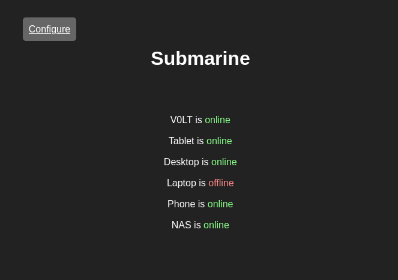

# Submarine

A simple status page to check connectivity to network targets.

## Description

Submarine is a simple self-hosted web utility that checks connectivity to a list of user-configured network targets. These targets can be just about device that the server hosting Subarmine has access to, including devices on the local network. If you have a large quantity of devices on your network, and you want to be able to quickly keep tabs on them, Submarine is a great way to do so.

## Screenshots

## Features

### Private

Submarine is completely self hosted, and doesn't collect or share any analytics with third-party services.

### Lightweight

Submarine is incredibly lightweight, and can be viewed from practically any device with a web-browser.

### Responsive

The Submarine interface adapts to all sorts of screen sizes using pure CSS, meaning even devices that don't support JavaScript work great.

### Accessible

The simple design of Submarine makes in inherently accessible. All of the webpages are clear and easy to read, even with visual impairments.

### Easy

After completing the initial installation process, Submarine doesn't require significant technical experience to use.

### Customizable

Submarine allows administrators to configure and customize the features, functionality, and theme through a conveinent web interface.

## Documentation

To learn more about how to install, set up, and use Submarine, see the [DOCUMENTATION.md](DOCUMENTATION.md) file.
